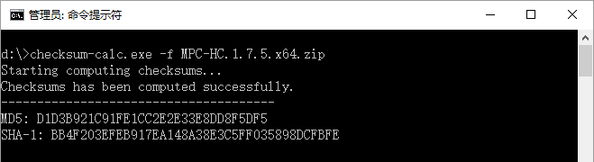

# checksum-calc

checksum-calc is a program which calculates file MD5, SHA-1 checksums. It's written in [Golang](http://golang.org).

#### Usage

    -f string
            File to calculate MD5 / SHA-1 hash. Ex: -f='my-cd.iso'
    Usage:
    checksum-calc -f=<file>
    Ex: checksum-calc -f='my-cd.iso'

#### Screenshot

#### License
* [MIT License](./LICENSE) 
